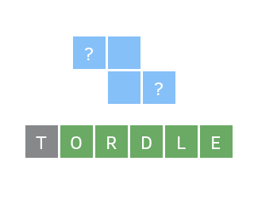
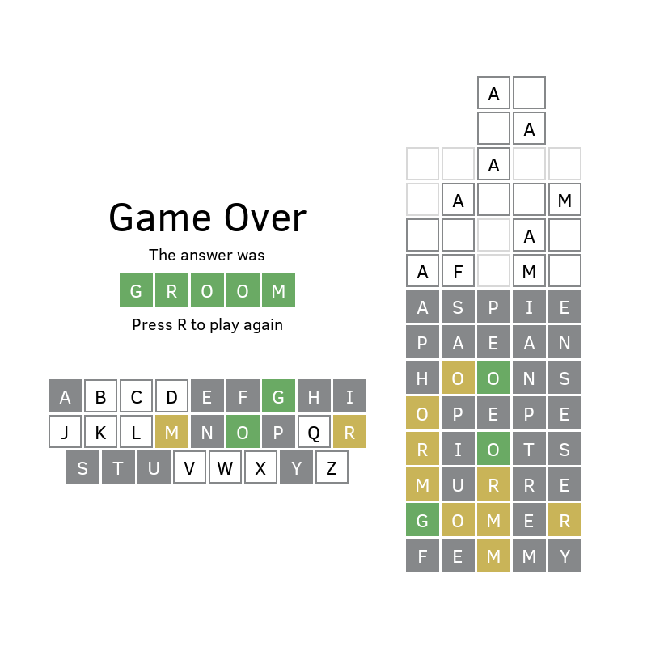

# Tordle

This is my [entry for Ludum Dare edition #50](https://ldjam.com/events/ludum-dare/50/tordle). I have a lot less free time these days, so I was quite happy with this edition's "Extra" mode, which gave me three week's worth of found time here and there to slowly write this game from scratch. The theme for this edition was "Delay the inevitable", which reminded me of Tetris. And in 2022, every game dev has to write at least one Wordle variant, it’s the law. So, here you go, a puzzle game about guessing a word by placing Tetrominos on a guess grid!

